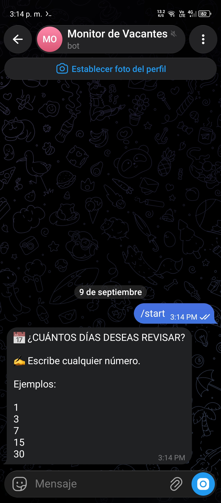
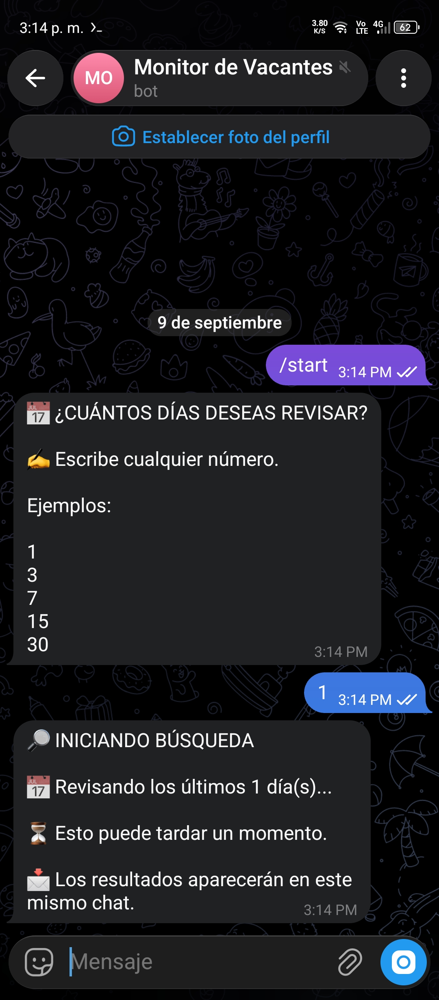
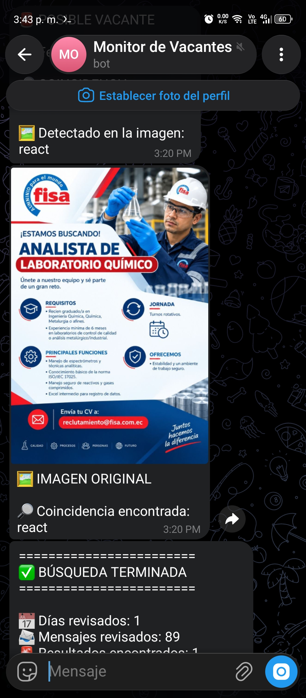

# 🤖 Bot de Empleo IT para Telegram

Bot automatizado desarrollado en Python que busca y filtra ofertas de empleo relacionadas con el área de Tecnología y envía las oportunidades encontradas directamente a Telegram.

## 🚀 Funcionalidades

- 🔎 Búsqueda automatizada de ofertas de empleo IT.
- 🎯 Filtrado de vacantes mediante palabras clave.
- 📅 Permite seleccionar la cantidad de días para realizar la búsqueda.
- 📢 Envío automático de resultados a Telegram.
- 🔄 Automatización del proceso de búsqueda.
- ✅ Notificación cuando el proceso de búsqueda finaliza.

## 🛠️ Tecnologías utilizadas

- Python
- Telegram Bot API
- python-telegram-bot
- Automatización
- Web Scraping / APIs

## 📸 Evidencia del funcionamiento

### 🤖 Bot de Telegram funcionando

#### 1️⃣ Inicio del bot

#### 2️⃣ Selección de días para la búsqueda

#### 3️⃣ Proceso de búsqueda de vacantes

#### 4️⃣ Resultados encontrados

#### 5️⃣ Finalización del proceso

## 📋 Palabras clave utilizadas

El bot filtra vacantes relacionadas con diferentes perfiles y tecnologías del área de desarrollo, entre ellas:

- Desarrollador
- Developer
- Programador
- Ingeniero de Sistemas
- Ingeniería de Sistemas
- Software
- Backend
- Frontend
- Full Stack
- .NET
- C#
- Python
- Java
- JavaScript
- React

## ⚙️ Funcionamiento

1. El usuario inicia el bot mediante Telegram.
2. Selecciona la cantidad de días en los que desea buscar vacantes.
3. El bot realiza la búsqueda automáticamente.
4. Se filtran las vacantes según las palabras clave configuradas.
5. Las oportunidades encontradas son enviadas directamente al usuario.
6. Al finalizar la búsqueda, el bot envía una notificación indicando que el proceso terminó.

## 👨‍💻 Autor

**Brayan Calderón**

Ingeniero en Sistemas | Full Stack Developer
